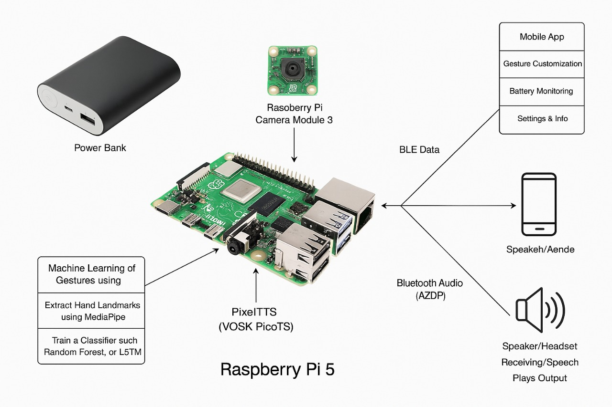

# Sign Language Detection System

A real-time sign language detection system that uses computer vision and machine learning to translate sign language gestures into text and speech.

## Project Overview



## Features

- Real-time sign language detection using webcam
- Support for 39 basic sign language words
- Customizable preset gestures (3 presets)
- Web interface for visualization
- Text-to-speech output
- Bluetooth connectivity support

## User Interface


## Project Structure

```
Pi 5 Sign/
├── test.py                 # Main backend for sign detection
├── bluetooth_webserver.py  # Flask web server with Bluetooth support
├── templates/              # Web interface templates
├── pose_classifier_final_new.h5    # Trained pose model
├── pose_labels_final_new.npy       # Pose model labels
├── preset_gesture_model.h5         # Preset gesture model
├── preset_gesture_labels.npy       # Preset gesture labels
├── pose_dataset.json               # Pose training data
├── presets.json                    # User-defined preset mappings
└── requirements.txt                # Project dependencies
```

## Installation

1. Clone the repository
2. Install dependencies:
```bash
pip install -r requirements.txt
```

## Usage

1. Start the web server:
```bash
python bluetooth_webserver.py
```

2. In a separate terminal, start the sign detection:
```bash
python test.py
```

3. Open your web browser and navigate to `http://localhost:5000`

## Preset Configuration

Edit `presets.json` to customize preset gestures:
```json
{
    "preset1": "Custom Word 1",
    "preset2": "Custom Word 2",
    "preset3": "Custom Word 3"
}
```

## Available Signs

The system recognizes the following 39 signs:
- Good Morning
- bag
- bathroom
- book
- call
- can
- clothes
- coffee
- come
- could
- done
- drink
- eat
- give
- go
- he
- hello
- help
- home
- i
- light
- like
- money
- my
- need
- no
- okay
- school
- see
- she
- stop
- take
- thank you
- they
- today
- walk
- want
- we
- you

## Requirements

- Python 3.8+
- OpenCV
- MediaPipe
- TensorFlow
- Flask
- pyttsx3
- numpy

## License

This project is licensed under the MIT License - see the LICENSE file for details. 
